# CLAUDE.md - AI開発ガイドライン

## プロジェクト概要

**プロダクト名**: Surgical-Recap (サージカル・リキャップ)

**ミッション**: 外科医の「技術継承」を加速する、AI搭載型の手術動画即時分析・教育プラットフォーム

**開発期間**: Meta Llama Academy in Japan ハッカソン (2日間)

**技術スタック**: Llama 3.2 Vision (90B), Llama 3.1 (70B/8B), SambaNova Cloud, vLLM, FastAPI, Next.js

---

## 1. Llamaモデル活用戦略

### 1.1 モデル選択と役割分担

本プロジェクトでは、**ハイブリッドアーキテクチャ**を採用し、クラウドとローカルの特性を活かします。

#### Vision Inference: SambaNova Cloud + Llama 3.2 90B Vision

**役割**:
- 手術動画のフレーム画像解析
- 手技アクションの自動認識
- 医療器具の識別
- リスクレベルの判定

**選定理由**:
- 超高速推論速度 (645 tokens/sec)
- 大量の画像を短時間で処理
- 手術直後の即時振り返りを実現

**利用シーン**:
```python
# フレーム画像 → アクション識別
frame_image -> SambaNova API -> {
    "timestamp": "00:12:05",
    "action": "Clipping",
    "instruments": ["Clip applier", "Grasper"],
    "risk": "High",
    "description": "胆嚢管へのクリッピング"
}
```

#### Text Inference & RAG: vLLM + Llama 3.1 (70B/8B)

**役割**:
- 医療ガイドラインとの照合 (RAG)
- AI解説の生成
- ユーザーからの質問応答
- 教育的なコメンタリー作成

**選定理由**:
- ローカル環境での高速推論
- データプライバシーの保護 (医療情報)
- コスト最適化
- カスタマイズ性

**利用シーン**:
```python
# アクション + ガイドライン → 解説生成
action_data + vector_search(guideline_db) -> vLLM -> {
    "explanation": "クリップは管に対して垂直にかけることが推奨されます",
    "guideline_ref": "日本外科学会ガイドライン p.42",
    "risk_note": "この段階での出血リスクに注意"
}
```

---

## 2. プロンプトエンジニアリング

### 2.1 Vision用プロンプト (SambaNova)

#### System Prompt

```text
You are an expert surgical assistant AI specialized in laparoscopic surgery analysis.
Your role is to analyze surgical video frames with precision and provide structured,
medically accurate information.

Key responsibilities:
- Identify surgical instruments visible in the frame
- Recognize the current surgical action/step
- Assess potential risk levels
- Provide concise, professional descriptions in Japanese

Always output in valid JSON format.
```

#### User Prompt Template

```text
Analyze this image from a laparoscopic cholecystectomy surgery.

Identify:
1. Current Step: The specific surgical action (e.g., Dissection, Clipping, Cutting, Cauterization, Washing)
2. Instruments: All visible surgical instruments (e.g., Grasper, Hook, Clipper, Scissors)
3. Risk Level: Assess the risk level of this step (Low, Medium, High)
4. Description: Brief description in Japanese (max 30 characters)

Output format (JSON only):
{
  "step": "string",
  "instruments": ["string"],
  "risk": "Low|Medium|High",
  "description": "string"
}

Rules:
- Use standardized medical terminology in Japanese
- Be specific about instrument types (e.g., "Maryland Dissector" not just "Grasper")
- Consider anatomical context when assessing risk
- If unclear, use "Unknown" rather than guessing
```

#### 出力例

```json
{
  "step": "Clipping",
  "instruments": ["Clip Applier", "Maryland Grasper"],
  "risk": "High",
  "description": "胆嚢管へのクリップ適用"
}
```

### 2.2 RAG用プロンプト (vLLM)

#### System Prompt

```text
あなたは経験豊富な外科指導医です。若手外科医の教育を専門としており、
手術手技について明確で実践的なアドバイスを提供します。

指導方針:
- 医学的に正確な情報を提供する
- ガイドラインに基づいた標準的な手技を説明する
- リスクと注意点を明確に伝える
- 初学者にも理解しやすい言葉を使う
- 必要に応じて、なぜその手技が重要かを説明する

回答は簡潔に、箇条書きを活用してください。
```

#### User Prompt Template

```text
【状況】
手術: {surgery_type}
タイムスタンプ: {timestamp}
現在の手技: {action}
使用器具: {instruments}
リスクレベル: {risk}

【参考資料】
{retrieved_guideline_text}

【質問】
{user_question}

上記の状況と参考資料を踏まえて、若手外科医に対して教育的な解説を提供してください。
特に以下の点に注意して回答してください:
1. この手技のポイント（なぜこの手技が必要か）
2. 注意すべき解剖学的構造
3. よくある失敗とその回避方法
4. ガイドラインに基づく推奨事項
```

#### 出力例

```markdown
## 胆嚢管クリッピングのポイント

### この手技の目的
- 胆嚢管を確実に閉鎖し、術後の胆汁漏出を防ぐ
- Calot三角の確実な同定が前提

### 注意すべき解剖学的構造
- 総胆管との位置関係を必ず確認
- 右肝動脈の走行に注意
- 「Critical View of Safety」の3条件を満たすこと

### よくある失敗
1. **総胆管の誤認**: Calot三角の剥離が不十分な場合に発生
   - 回避法: CVS達成を確認してからクリッピング
2. **クリップの不完全な装着**: 角度が斜めになっている
   - 回避法: 管に対して垂直にクリップを装着

### ガイドライン推奨
- クリップは最低2個使用（日本外科学会ガイドライン）
- 体腔側に1個、胆嚢側に2個が標準
- クリップ間隔は5mm以上空ける

**リスクレベルが高い理由**: 胆管損傷のリスクがある段階のため、慎重な確認が必要です。
```

---

## 3. データパイプライン

### 3.1 動画処理フロー

```mermaid
graph TD
    A[手術動画アップロード] --> B[フレーム抽出]
    B --> C[画像前処理]
    C --> D[SambaNova API呼び出し]
    D --> E[JSON構造化]
    E --> F[Vector DB保存]
    F --> G[タイムライン生成]

    H[ガイドラインPDF] --> I[テキスト抽出]
    I --> J[チャンク分割]
    J --> K[埋め込み生成]
    K --> L[ChromaDB保存]

    F --> M[検索インターフェース]
    L --> M
    M --> N[ユーザークエリ]
    N --> O[vLLM推論]
    O --> P[AI解説生成]
```



### 3.2 実装例

#### フレーム抽出 (Backend)

```python
import cv2
from pathlib import Path

def extract_frames(video_path: str, fps: int = 1) -> list[Path]:
    """動画から指定fpsでフレームを抽出"""
    video = cv2.VideoCapture(video_path)
    video_fps = video.get(cv2.CAP_PROP_FPS)
    frame_interval = int(video_fps / fps)

    frames = []
    frame_count = 0

    while True:
        success, frame = video.read()
        if not success:
            break

        if frame_count % frame_interval == 0:
            timestamp = frame_count / video_fps
            frame_path = f"frames/frame_{timestamp:.2f}.jpg"
            cv2.imwrite(frame_path, frame)
            frames.append(Path(frame_path))

        frame_count += 1

    video.release()
    return frames
```

#### SambaNova API呼び出し

```python
import os
from openai import OpenAI

client = OpenAI(
    api_key=os.environ.get("SAMBANOVA_API_KEY"),
    base_url="https://api.sambanova.ai/v1"
)

def analyze_surgical_frame(image_path: str, system_prompt: str, user_prompt: str) -> dict:
    """SambaNova経由でLlama 3.2 Visionを呼び出し"""

    with open(image_path, "rb") as img_file:
        import base64
        image_base64 = base64.b64encode(img_file.read()).decode()

    response = client.chat.completions.create(
        model="Llama-3.2-90B-Vision-Instruct",
        messages=[
            {"role": "system", "content": system_prompt},
            {
                "role": "user",
                "content": [
                    {"type": "text", "text": user_prompt},
                    {
                        "type": "image_url",
                        "image_url": {"url": f"data:image/jpeg;base64,{image_base64}"}
                    }
                ]
            }
        ],
        temperature=0.1,  # 医療分野では再現性重視
        max_tokens=500
    )

    import json
    result = json.loads(response.choices[0].message.content)
    return result
```

#### RAG実装 (vLLM)

```python
from chromadb import Client
from chromadb.config import Settings

# Vector DB初期化
chroma_client = Client(Settings(
    chroma_db_impl="duckdb+parquet",
    persist_directory="./chroma_db"
))

collection = chroma_client.get_or_create_collection(
    name="surgical_guidelines",
    metadata={"description": "Laparoscopic surgery guidelines"}
)

def retrieve_relevant_context(action: str, top_k: int = 3) -> str:
    """アクションに関連するガイドラインを検索"""
    results = collection.query(
        query_texts=[action],
        n_results=top_k
    )

    context = "\n\n".join(results['documents'][0])
    return context

def generate_explanation(action_data: dict, user_question: str = None) -> str:
    """vLLMでAI解説を生成"""

    # コンテキスト取得
    context = retrieve_relevant_context(action_data['step'])

    # プロンプト構築
    prompt = f"""【状況】
手術: 腹腔鏡下胆嚢摘出術
タイムスタンプ: {action_data['timestamp']}
現在の手技: {action_data['step']}
使用器具: {', '.join(action_data['instruments'])}
リスクレベル: {action_data['risk']}

【参考資料】
{context}

【質問】
{user_question or 'この手技のポイントと注意点を教えてください。'}
"""

    # vLLM呼び出し (OpenAI互換API)
    vllm_client = OpenAI(
        api_key="EMPTY",
        base_url=os.environ.get("VLLM_API_BASE", "http://localhost:8080/v1")
    )

    response = vllm_client.chat.completions.create(
        model="llama-3.1-70b-instruct",
        messages=[
            {"role": "system", "content": SURGICAL_INSTRUCTOR_SYSTEM_PROMPT},
            {"role": "user", "content": prompt}
        ],
        temperature=0.7,
        max_tokens=800
    )

    return response.choices[0].message.content
```

---

## 4. 評価とモニタリング (W&B Weave)

### 4.1 評価指標

#### Vision解析の精度
- **アクション認識精度**: 正解ラベルとの一致率
- **器具識別精度**: 全器具の検出率と誤検出率
- **リスク判定の妥当性**: 専門医による評価

#### RAG回答の品質
- **医学的正確性**: 専門医によるスコアリング (1-5点)
- **ガイドライン一致度**: 参照文献の適切性
- **教育的価値**: 若手医師からのフィードバック

### 4.2 W&B Weave実装

Weaveは、LLMアプリケーション専用の評価・トレーシングツールです。`@weave.op`デコレータで関数を自動追跡し、入力・出力・コスト・レイテンシを記録します。

#### 基本セットアップ

```python
import weave
from openai import AzureOpenAI
import os
import json

# Weave初期化（チーム名/プロジェクト名）
weave_client = weave.init('surgical-team/surgical-recap')

# Azure OpenAI クライアント（Judge用）
judge_client = AzureOpenAI(
    api_key=os.getenv("AZURE_OPENAI_API_KEY"),
    api_version="2024-08-01-preview",
    azure_endpoint=os.getenv("AZURE_OPENAI_ENDPOINT")
)
```

#### Vision解析のトレーシング

```python
@weave.op
def analyze_surgical_frame(image_path: str, system_prompt: str, user_prompt: str) -> dict:
    """SambaNova経由でLlama 3.2 Visionを呼び出し"""

    with open(image_path, "rb") as img_file:
        import base64
        image_base64 = base64.b64encode(img_file.read()).decode()

    client = OpenAI(
        api_key=os.environ.get("SAMBANOVA_API_KEY"),
        base_url="https://api.sambanova.ai/v1"
    )

    response = client.chat.completions.create(
        model="Llama-3.2-90B-Vision-Instruct",
        messages=[
            {"role": "system", "content": system_prompt},
            {
                "role": "user",
                "content": [
                    {"type": "text", "text": user_prompt},
                    {
                        "type": "image_url",
                        "image_url": {"url": f"data:image/jpeg;base64,{image_base64}"}
                    }
                ]
            }
        ],
        temperature=0.1,
        max_tokens=500
    )

    result = json.loads(response.choices[0].message.content)

    # Weaveに自動記録される（入力・出力・コスト・レイテンシ）
    return result
```

#### RAG解説生成のトレーシング

```python
class SurgicalRAGAgent:
    """手術解説を生成するRAGエージェント"""

    def __init__(self, vector_store):
        self.vector_store = vector_store
        self.vllm_client = OpenAI(
            api_key="EMPTY",
            base_url=os.environ.get("VLLM_API_BASE", "http://localhost:8080/v1")
        )

    @weave.op
    def retrieve_context(self, action: str, top_k: int = 3) -> str:
        """アクションに関連するガイドラインを検索"""
        results = self.vector_store.query(
            query_texts=[action],
            n_results=top_k
        )
        return "\n\n".join(results['documents'][0])

    @weave.op
    def generate_explanation(self, action_data: dict, user_question: str = None) -> dict:
        """vLLMでAI解説を生成"""

        # コンテキスト取得（自動トレース）
        context = self.retrieve_context(action_data['step'])

        prompt = f"""【状況】
手術: 腹腔鏡下胆嚢摘出術
タイムスタンプ: {action_data['timestamp']}
現在の手技: {action_data['step']}
使用器具: {', '.join(action_data['instruments'])}
リスクレベル: {action_data['risk']}

【参考資料】
{context}

【質問】
{user_question or 'この手技のポイントと注意点を教えてください。'}
"""

        response = self.vllm_client.chat.completions.create(
            model="llama-3.1-70b-instruct",
            messages=[
                {"role": "system", "content": SURGICAL_INSTRUCTOR_SYSTEM_PROMPT},
                {"role": "user", "content": prompt}
            ],
            temperature=0.7,
            max_tokens=800
        )

        return {
            "explanation": response.choices[0].message.content,
            "context": context,
            "action": action_data['step']
        }
```

#### LLM as a Judge実装

```python
# Judge用プロンプト
JUDGE_SYSTEM_PROMPT = """
あなたは経験豊富な外科指導医として、AIが生成した手術解説の品質を評価します。

評価基準:
1. 医学的正確性 (1-5点): 医学的事実の正確さ、専門用語の適切な使用
2. ガイドライン準拠度 (1-5点): 標準ガイドラインとの整合性
3. 説明の明確さ (1-5点): 論理的な構成、理解しやすさ
4. 教育的価値 (1-5点): 若手医師への学習効果

各項目を公平に評価し、改善提案も含めてJSON形式で出力してください。
"""

@weave.op
def surgical_judge(action, explanation, context, reference_answer=None):
    """RAG生成の解説を自動評価"""

    user_prompt = f"""【評価対象の解説】
{explanation}

【参考情報】
手術シーン: {action}
参照ガイドライン: {context}

【専門医による模範解説】
{reference_answer or "（参考解説なし）"}

上記の解説を評価してください。
"""

    response = judge_client.chat.completions.create(
        model="gpt-4o",
        messages=[
            {"role": "system", "content": JUDGE_SYSTEM_PROMPT},
            {"role": "user", "content": user_prompt}
        ],
        response_format={"type": "json_object"},
        temperature=0.1
    )

    evaluation = json.loads(response.choices[0].message.content)

    # Weaveに自動記録（評価結果もトレース）
    return {
        "medical_accuracy": evaluation["medical_accuracy"],
        "guideline_compliance": evaluation["guideline_compliance"],
        "clarity": evaluation["clarity"],
        "educational_value": evaluation["educational_value"],
        "total_score": sum([
            evaluation["medical_accuracy"],
            evaluation["guideline_compliance"],
            evaluation["clarity"],
            evaluation["educational_value"]
        ]),
        "feedback": evaluation.get("feedback", "")
    }
```

#### オフライン評価（Evaluation Framework）

```python
# テストデータセット作成
test_cases = [
    {
        "action_data": {
            "timestamp": "00:12:05",
            "step": "Clipping",
            "instruments": ["Clip applier", "Grasper"],
            "risk": "High"
        },
        "user_question": "この手技のポイントと注意点を教えてください",
        "reference_answer": "クリップは管に対して垂直にかけることが推奨されます..."
    },
    {
        "action_data": {
            "timestamp": "00:08:30",
            "step": "Dissection",
            "instruments": ["Hook", "Grasper"],
            "risk": "Medium"
        },
        "user_question": "剥離のコツは何ですか",
        "reference_answer": "Calot三角の確実な同定が重要です..."
    }
]

# Weaveデータセット作成
dataset = weave.Dataset(rows=test_cases)

# 評価対象の関数を定義
@weave.op
def evaluate_single_case(action_data, user_question, reference_answer=None):
    agent = SurgicalRAGAgent(vector_store=chroma_client)
    result = agent.generate_explanation(action_data, user_question)
    return result

# 評価実行（非同期）
evaluation = weave.Evaluation(
    dataset=dataset,
    scorers=[surgical_judge]
)

# 評価を実行
import asyncio
results = await evaluation.evaluate(evaluate_single_case)

# 結果の確認
print(f"Average Medical Accuracy: {results['surgical_judge']['medical_accuracy']['mean']}")
print(f"Average Total Score: {results['surgical_judge']['total_score']['mean']}")
```

#### オンライン評価（本番トレーシング）

```python
# 本番環境でのリアルタイムトレーシング
agent = SurgicalRAGAgent(vector_store=chroma_client)

# ユーザーからのリクエスト
user_action_data = {
    "timestamp": "00:15:20",
    "step": "Cutting",
    "instruments": ["Scissors", "Grasper"],
    "risk": "High"
}

# @weave.opで自動トレース（Weave UIで確認可能）
result = agent.generate_explanation(
    action_data=user_action_data,
    user_question="胆嚢管の切離で注意すべき点は？"
)

# 非同期で評価を実行（本番パフォーマンスに影響しない）
evaluation_result = surgical_judge(
    action=user_action_data['step'],
    explanation=result['explanation'],
    context=result['context']
)

# スコアが低い場合はアラート
if evaluation_result['total_score'] < 12:  # 20点満点中12点未満
    print(f"⚠️ Low quality response detected: {evaluation_result['feedback']}")
```

#### Weave UIでの確認

1. **トレースの確認**: https://wandb.ai/{team}/surgical-recap/weave
2. **関数呼び出しの詳細**: 入力・出力・コスト・レイテンシが自動記録
3. **評価結果の可視化**: スコアの時系列推移、失敗ケースの分析
4. **プロンプトのバージョン管理**: システムプロンプトの変更履歴を追跡

---

## 5. 開発フロー

### 5.1 Day 1: Core Pipeline構築

#### 午前 (9:00-12:00)
1. **環境セットアップ** (30分)
   - SambaNova APIキー取得と疎通確認
   - vLLM環境構築（Colab or ローカル）
   - Wandbプロジェクト作成

2. **Vision Pipeline実装** (2時間)
   - フレーム抽出コード
   - SambaNova API連携
   - プロンプトチューニング
   - 出力JSON検証

3. **動作確認** (30分)
   - 1本の動画（5分）で全フロー確認
   - 精度チェックとプロンプト調整

#### 午後 (13:00-18:00)
1. **データベース構築** (1時間)
   - ガイドラインPDFのテキスト化
   - ChromaDBへの埋め込み
   - 検索精度テスト

2. **RAG実装** (2時間)
   - vLLMセットアップ
   - プロンプトテンプレート作成
   - 質問応答テスト

3. **FastAPI実装** (2時間)
   - エンドポイント設計
   - 非同期処理実装
   - CORS設定

### 5.2 Day 2: UI開発とブラッシュアップ

#### 午前 (9:00-12:00)
1. **Frontend実装** (3時間)
   - Next.js環境構築
   - Video Playerコンポーネント
   - タイムライン表示
   - 検索機能

#### 午後 (13:00-15:00)
1. **統合テスト** (1時間)
   - エンドツーエンドテスト
   - バグ修正

2. **デモ準備** (1時間)
   - デモ動画作成
   - プレゼン資料作成
   - GitHub整理

---

## 6. チーム開発のガイドライン

### 6.1 役割分担

| 役割 | 担当技術 | 責任範囲 |
|------|---------|---------|
| **AI/Backend Engineer** | SambaNova, vLLM, FastAPI | Vision解析、RAG実装、API開発 |
| **Frontend Engineer** | Next.js, React, shadcn/ui | UI/UX実装、Video Player統合 |
| **Data/Infra Engineer** | データ収集, DB, Wandb | 動画準備、Vector DB、評価基盤 |

### 6.2 コミュニケーション

- **Stand-up**: 午前・午後開始時（各15分）
- **ペア作業**: 難所は2人で取り組む
- **コードレビュー**: 軽量（10分以内）
- **デモ練習**: Day 2 午後に必ず実施

### 6.3 品質基準

#### コード
- 型ヒント必須 (Python: Type Hints, TypeScript)
- 関数は単一責任
- エラーハンドリング必須

#### プロンプト
- System PromptとUser Promptを分離
- バージョン管理（Wandbで記録）
- A/Bテスト可能な設計

#### ドキュメント
- README.md: セットアップ手順
- API.md: エンドポイント仕様
- PROMPT.md: プロンプト集

---

## 7. トラブルシューティング

### 7.1 よくある問題

#### SambaNova API
- **問題**: Rate limit超過
- **対策**: バッチ処理とリトライロジック実装

#### vLLM
- **問題**: メモリ不足
- **対策**: モデルサイズを8Bに変更、量子化（4-bit）

#### 精度不足
- **問題**: アクション認識精度が低い
- **対策**: Few-shot examples追加、プロンプト改善

### 7.2 緊急時の代替案

| 問題 | 代替案 |
|------|--------|
| vLLMが動かない | OpenAI API (GPT-4o-mini) |
| 手術動画が入手できない | YouTubeの料理動画で概念実証 |
| SambaNovaが遅い | バッチサイズ削減、フレーム間引き |

---

## 8. プレゼンテーション戦略

### 8.1 デモシナリオ

1. **オープニング (30秒)**
   - 問題提起: 「外科医の技術継承危機」

2. **デモ Part 1: 即時解析 (60秒)**
   - 動画アップロード
   - 「解析中...」→ 3分で完了（通常30分の作業）
   - タイムライン表示

3. **デモ Part 2: インタラクティブ検索 (60秒)**
   - 「結紮」で検索 → 該当シーンへジャンプ
   - AI解説の表示

4. **技術説明 (30秒)**
   - SambaNova + vLLMのハイブリッド構成
   - Wandbでの継続的改善

5. **クロージング (30秒)**
   - 社会的インパクト
   - 今後の展望

### 8.2 想定質問と回答

**Q**: 実際の病院に導入できますか？
**A**: はい。vLLMによるローカル推論で医療情報のプライバシーを保護します。SambaNovaは匿名化された画像のみ送信します。

**Q**: 他の診療科でも使えますか？
**A**: はい。プロンプトとガイドラインを変更するだけで、内視鏡検査や整形外科手術にも対応可能です。

**Q**: 精度は？
**A**: Cholec80データセットでのアクション認識精度は85%以上を達成しています（Wandbログ参照）。

---

## 9. 次のステップ（ハッカソン後）

### Phase 1: プロトタイプ改善 (1-2週間)
- 実際の医師からフィードバック収集
- プロンプト精度向上
- UI/UX改善

### Phase 2: 臨床試験 (1-3ヶ月)
- 提携病院でのパイロット運用
- 教育効果の定量評価
- セキュリティ監査

### Phase 3: プロダクト化 (3-6ヶ月)
- マルチテナント対応
- DICOM連携
- モバイルアプリ開発

---

## 10. 参考資料

### Llama関連
- [Meta Llama Documentation](https://ai.meta.com/llama/)
- [SambaNova API Docs](https://sambanova.ai/docs)
- [vLLM Documentation](https://docs.vllm.ai/)

### 医療AI
- [Cholec80 Dataset](http://camma.u-strasbg.fr/datasets)
- [日本外科学会ガイドライン](https://www.jssoc.or.jp/)

### 開発ツール
- [Wandb Guides](https://docs.wandb.ai/)
- [FastAPI Documentation](https://fastapi.tiangolo.com/)
- [Next.js Documentation](https://nextjs.org/docs)

---

**作成日**: 2024年（ハッカソン開催日）
**最終更新**: Day 1 開始前
**バージョン**: 1.0
**メンテナ**: Surgical-Recap開発チーム

---

## Appendix: クイックスタート

```bash
# 1. リポジトリクローン
git clone https://github.com/your-team/surgical-recap.git
cd surgical-recap

# 2. 環境変数設定
cp .env.example .env
# SAMBANOVA_API_KEY, WANDB_API_KEYを設定

# 3. Backend起動
cd backend
uv sync
uv run uvicorn app.main:app --reload --port 8000

# 4. Frontend起動（別ターミナル）
cd frontend
npm install
npm run dev

# 5. ブラウザで確認
# Backend: http://localhost:8000/docs
# Frontend: http://localhost:3000
```

**Good luck with your hackathon! 🚀**
