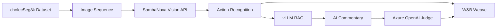

# Surgical-Recap (サージカル・リキャップ)

外科医の「技術継承」を加速する、AI搭載型の手術画像解析・教育プラットフォーム

[](https://www.python.org/)
[](https://fastapi.tiangolo.com/)
[](https://wandb.ai/site/weave)
[](LICENSE)

## 🎯 プロジェクト概要

**Surgical-Recap**は、腹腔鏡下胆嚢摘出術の画像シーケンスを分析し、手術手技の自動認識とAIによる教育的解説を提供するプラットフォームです。

### 主な特徴

- **⚡ 超高速解析**: SambaNova Cloud (Llama 3.2 90B Vision) による画像解析
- **🎓 教育的解説**: vLLM (Llama 3.1 70B) + RAGによるガイドライン基づく解説
- **📊 自動評価**: W&B Weave + Azure OpenAI (GPT-4o) によるLLM as a Judge評価
- **🔍 精度検証**: cholecSeg8kデータセットのGround Truthと比較

## 🏗️ アーキテクチャ



## 🚀 クイックスタート

### 前提条件

- Python 3.12+
- uv (Pythonパッケージマネージャー)
- Node.js 18+ (フロントエンド用)
- Kaggle Account (データセットダウンロード用)

### 1. リポジトリのクローン

```bash
git clone https://github.com/Shibata-1273352/surgical-recap.git
cd surgical-recap
```

### 2. バックエンド環境のセットアップ

```bash
# uvのインストール（未インストールの場合）
curl -LsSf https://astral.sh/uv/install.sh | sh

# 依存関係のインストール
cd backend
uv sync
```

### 3. データセットのダウンロード

```bash
# Kaggle APIの設定
# ~/.kaggle/kaggle.json にAPIキーを配置

# データセットのダウンロード
uv run python scripts/download_dataset.py
```

### 4. 環境変数の設定

```bash
# プロジェクトルートに移動
cd ..

# .envファイルを作成
cp .env.example .env

# .envファイルを編集してAPIキーを設定
nano .env
```

必要な環境変数:
- `SAMBANOVA_API_KEY`: SambaNova Cloud APIキー
- `WANDB_API_KEY`: W&B APIキー
- `AZURE_OPENAI_API_KEY`: Azure OpenAI APIキー
- `AZURE_OPENAI_ENDPOINT`: Azure OpenAIエンドポイント

### 5. 開発環境の起動

#### 🚀 一括起動（推奨）

```bash
# バックエンド + フロントエンドを一括起動
./start.sh

# 停止
./stop.sh
```

アクセスURL:
- フロントエンド: http://localhost:3000
- チャット画面: http://localhost:3000/chat
- バックエンドAPI: http://localhost:8000
- APIドキュメント: http://localhost:8000/docs

#### 個別起動

**バックエンド:**
```bash
cd backend
uv run uvicorn app.main:app --reload --port 8000
```

**フロントエンド:**
```bash
cd frontend
npm run dev
```

## 📁 プロジェクト構造

```
surgical-recap/
├── backend/                 # FastAPI バックエンド
│   ├── app/
│   │   ├── main.py         # FastAPIアプリケーション
│   │   └── dataset.py      # データセットローダー
│   ├── scripts/
│   │   └── download_dataset.py  # データセット ダウンロード
│   ├── data/               # データセット保存先 (gitignore)
│   ├── pyproject.toml      # 依存関係定義
│   └── uv.lock            # ロックファイル
├── frontend/               # Next.js フロントエンド (未実装)
├── .env.example           # 環境変数テンプレート
├── .gitignore
├── CLAUDE.md              # AI開発ガイドライン
├── requirements_definition.md  # 要件定義書
└── README.md
```

## 🛠️ 技術スタック

### Backend
- **Framework**: FastAPI
- **Package Manager**: uv
- **Vision API**: SambaNova Cloud (Llama 3.2 90B Vision)
- **Text Inference**: vLLM (Llama 3.1 70B)
- **Evaluation**: W&B Weave + Azure OpenAI (GPT-4o)
- **Vector DB**: ChromaDB
- **Image Processing**: OpenCV

### Frontend (計画)
- **Framework**: Next.js 14 (App Router)
- **Language**: TypeScript
- **Styling**: Tailwind CSS + shadcn/ui
- **Image Viewer**: Custom React Component

## 📊 データセット

**cholecSeg8k**: 腹腔鏡下胆嚢摘出術の画像約8,000フレーム

- **出典**: [Kaggle - cholecSeg8k](https://www.kaggle.com/datasets/newslab/cholecseg8k)
- **内容**: 手術フレーム画像 + セグメンテーションマスク + アノテーション
- **用途**: Vision解析の学習と評価

## 🔬 評価システム

### LLM as a Judge

Azure OpenAI (GPT-4o) を使用してRAG生成コンテンツを自動評価:

- **医学的正確性** (1-5点)
- **ガイドライン準拠度** (1-5点)
- **説明の明確さ** (1-5点)
- **教育的価値** (1-5点)

### W&B Weave統合

- 自動トレーシング（`@weave.op`デコレータ）
- 評価メトリクスの時系列追跡
- プロンプトバージョン管理

## 📝 開発ガイドライン

詳細は以下のドキュメントを参照:

- [CLAUDE.md](CLAUDE.md): AI開発ガイドライン
- [requirements_definition.md](requirements_definition.md): 要件定義書

## 🤝 コントリビューション

このプロジェクトは Meta Llama Academy in Japan ハッカソンのために開発されています。

## 📄 ライセンス

MIT License

## 👥 チーム

Surgical-Recap Development Team

---

**Generated with** [Claude Code](https://claude.com/claude-code)
